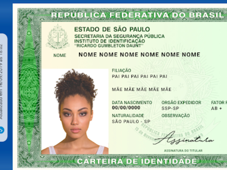

# Face Recognition

## Funcionalidade
- Retorna o recorte região da face reconhecida na imagem fornecida.
 
## Como Funciona ?
- Envie um base64 ou url de uma imagem que se deseja reconhecer a face;
- A API retornará um base64 da região da face reconhecida;

## Exemplo de Request por url:
```json
  {
	"img": "https://i.imgur.com/xQ5wQmI.png"
  }
```

## Exemplo de Request por base64:
```json
  {
	"img": "data:image/png;base64,iVBORw0KGgoAAAANSUhEUgAAAcIAAAFRCAIAAABoiDr/AANoK0lE....."
  }
```

## Exemplo de Response:
```json
  {
    "data": {
      "data": "iVBORw0KGgoAAAANSUhEUgAAAFAAAABQCAIAAAABc2X6AAAgAElEQVR4AaXBCdCuaVkg5nt7nu......."
    }
  }
```
## Exemplo de Imagens:

## Imagem Original


## Imagem Recortada

